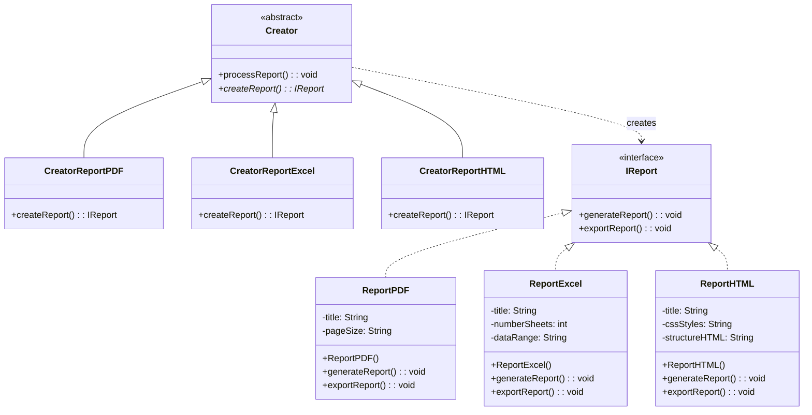
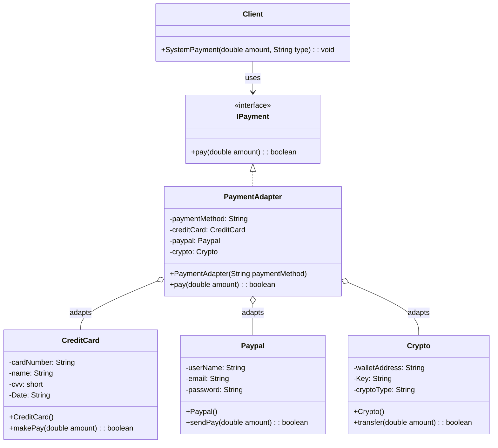
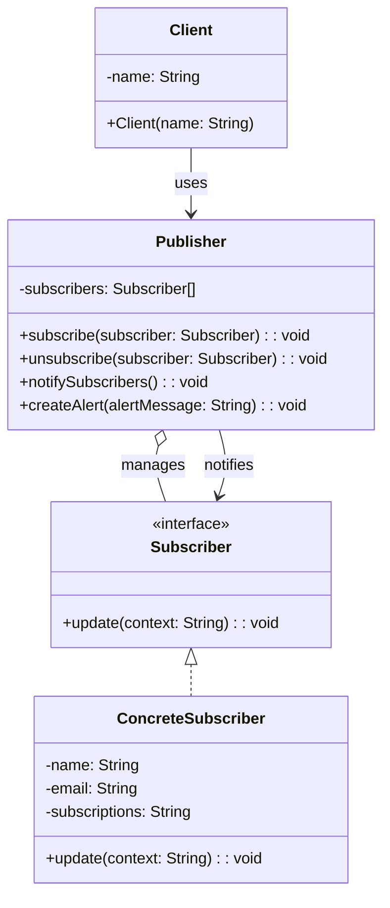

# 📌 Patrones de diseño

Este repositorio contiene la implementación en **Java** de tres patrones de diseño: **Factory Method (creacional)**, **Adapter (estructural)** y **Observer (comportamental)**. Cada sección incluye una descripción del problema, la solución propuesta, la justificación y un diagrama de clases optimizado para claridad.

---

## 🏭 Patrones Creacionales

### Situación
Imagina que tu aplicación debe generar **múltiples tipos de reportes**:
- **PDF** para documentos formales.
- **Excel** para reportes numéricos y análisis de datos.
- **HTML** para visualización rápida en la web.

**Requerimiento**: El sistema debe producir cualquier formato de reporte según la necesidad del usuario, sin modificar la lógica central de negocio.

### Pregunta
¿Qué patrón de diseño **creacional** aplicarías para garantizar que el sistema pueda crear diferentes tipos de reportes de forma flexible y escalable? Justifica la respuesta con un diagrama de clases.

### Respuesta: Factory Method

### Justificación
- **Encapsulación**: `Factory Method` encapsula la creación de objetos (reportes) en una jerarquía de creadores (`Creator` y sus variantes concretas).
- **Abstracción**: La lógica de negocio (`processReport()`) trabaja contra la interfaz `IReport`, sin conocer las clases concretas (`ReportPDF`, `ReportExcel`, `ReportHTML`).
- **Escalabilidad**: Permite añadir nuevos tipos de reportes creando una nueva subclase de `Creator`, sin modificar la lógica existente.
- **Principio Abierto/Cerrado**: Abierto para extensión, cerrado para modificación.

### Diagrama de clases

---

## 🔌 Patrones Estructurales

### Situación
Tu aplicación debe integrar un **sistema de pago** con múltiples métodos:
- **Tarjeta de crédito**.
- **PayPal**.
- **Criptomonedas**.

**Problema**: Cada método fue desarrollado de manera independiente y expone una interfaz diferente. Necesitas que todos los métodos de pago se comporten de forma unificada, sin modificar el código original de cada servicio externo.

### Pregunta
¿Qué patrón de diseño **estructural** aplicarías para unificar las interfaces de los métodos de pago y que el sistema los use de forma consistente? Justifica la respuesta con un diagrama de clases.

### Respuesta: Adapter

### Justificación
- **Interoperabilidad**: `Adapter` permite que clases con interfaces incompatibles trabajen juntas sin modificar su código fuente.
- **Intermediario**: `PaymentAdapter` implementa la interfaz común `IPayment` y adapta las llamadas a los métodos específicos de cada servicio de pago.
- **Desacoplamiento**: El cliente (`Client`) solo conoce la interfaz `IPayment`, sin depender de las implementaciones específicas.
- **Escalabilidad**: Facilita la integración de nuevos métodos de pago sin afectar el código existente.

### Diagrama de clases

---

## 👀 Patrones Comportamentales

### Situación
Tienes un **sistema de notificaciones** que envía **alertas** (ej.: "nuevo mensaje", "pedido enviado", "saldo bajo") a **múltiples usuarios suscritos**. Los usuarios pueden **suscribirse** o **cancelar su suscripción** dinámicamente, y cada alerta debe propagarse automáticamente a todos los suscriptores interesados, sin acoplar fuertemente el emisor con los receptores.

### Pregunta
¿Qué patrón de diseño **comportamental** aplicarías para gestionar las suscripciones y la difusión de alertas a múltiples receptores? Justifica la respuesta con un diagrama de clases.

### Respuesta: Observer

### Justificación
- **Dependencia uno-a-muchos**: `Observer` permite que un cambio en el `Publisher` notifique automáticamente a todos sus `Subscribers`.
- **Flexibilidad**: Los suscriptores pueden agregarse o eliminarse dinámicamente en tiempo de ejecución.
- **Desacoplamiento**: El `Publisher` no necesita conocer las clases concretas de los suscriptores, solo la interfaz `Subscriber`.
- **Propagación automática**: Las alertas se envían a todos los suscriptores sin intervención manual.
- **Principio de responsabilidad única**: El `Publisher` gestiona suscripciones, mientras los `Subscribers` manejan las notificaciones.

### Diagrama de clases

### Readme realizado con apoyo de IA.
